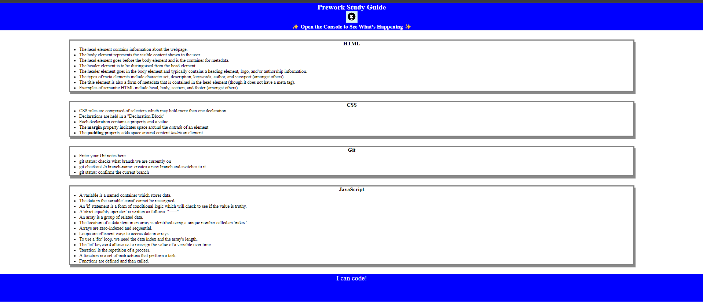

# Prework Study Guide Webpage

## Description

This Prework Study was created to display notes relating to learning HTML, CSS, JS, Git, and README. It was created using these languages, platorms, and methods. It is a reference tool which summarizes the main points, completes the Prework for the course, and enables the user to comprehend and revisit fundamentals. Please refer to the notes which outline the learning.

## Installation

N/A

## Usage

To use this Prework Study Guide, you can refer to the notes in each section. For a suggestion on what to study first, open the console by pressing F12 or right clicking and selecting "inspect".

## Credits

N/A

## License

MIT license.